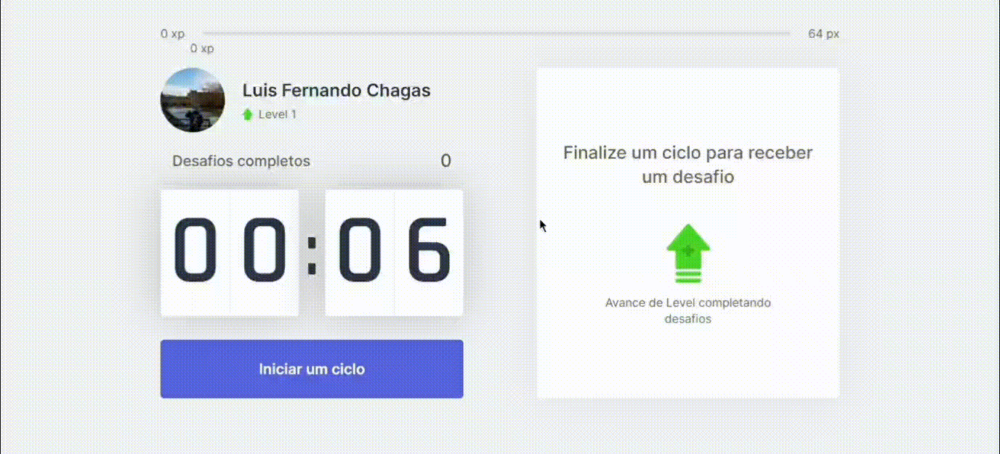

<h1 align="center">
    
</h1>

<h1 align="center">
    <p>Tela inicial</p>
    
</h1>

<h1 align="center">
    <p>Em Funcionamento</p>
    
</h1>

## Index

- [about](#-About)
- [Tecnologias utilizadas](#-Tecnologias-utilizadas)
- [Melhorias](#-Melhorias)
- [Como instalar](#-Como-instalar)
- [Créditos](#-Creditos)
- [Licença](#-Licença)

---

## About

- A função dessa aplicação é a implementação da técnica pomodoro.
- Essa técnica pode ser utilizada em trabalhos/atividades muito longas em que é requisitado um pequeno período de descanso para quem está executando a atividade.
- Essa técnica consiste em intervalos de 25 em 25 minutos e ao final desse tempo, é passado uma atividade aleatória para descansar durante uma longa jornada de trabalho
- Também é possível subir de nível conforme as atividades forem concluídas com êxito

---

## Tecnologias utilizadas

- [React](https://pt-br.reactjs.org/)
- [Next.js](https://nextjs.org/)
- [TypeScript](https://www.typescriptlang.org/)

---

## Melhorias

É possível parar o cronômetro e continuar caso haja algum imprevisto

---

## Como instalar

``` bash
# Clone repository
$ git clone https://github.com/LuisFernandoChagas/NLW-4.git

# Access directory
$ cd ./NLW-4

# Dependencies
$ npm install

# Run code
$ npm run dev

```

---

## Créditos

Projeto desenvolvido durante a Next Level Week 4. Iniciativa da Rocketseat 🚀


---

## Licença
Código totalmente aberto e gratuito para estudos e cópias sob a licença MIT License